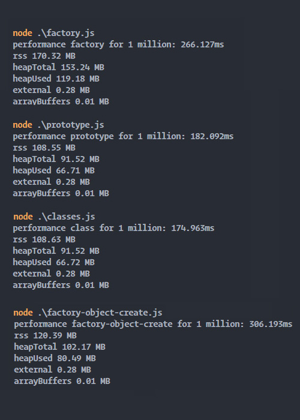

# Node instances benchmarks
## Which is the faster method to declare 1 million of objects instances in a simple array?

The methods used in this test are: 
- Factory method using function with arguments and closures, see this [link](https://www.theodinproject.com/lessons/node-path-javascript-factory-functions-and-the-module-pattern#factory-function-introduction) for more informations
- Prototype method using prototype inheritance, as the same as Javascript does for methods like push for arrays, see this [link](https://www.w3schools.com/js/js_object_prototypes.asp) for more informations
- Class method using the keyword class that creates a special function, see this [link](https://developer.mozilla.org/en-US/docs/Web/JavaScript/Reference/Classes) for more informations
- Factory method with Object.assign + Object.create, another method but similar to the first but different in terms of performance, see this [link](https://medium.com/javascript-scene/3-different-kinds-of-prototypal-inheritance-es6-edition-32d777fa16c9) for more informations

